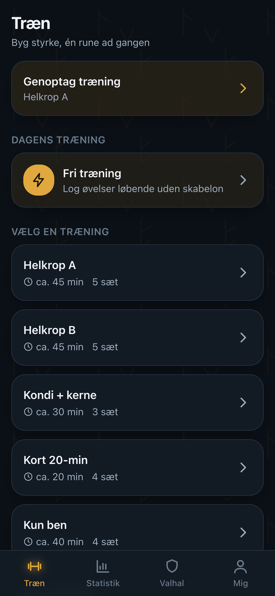
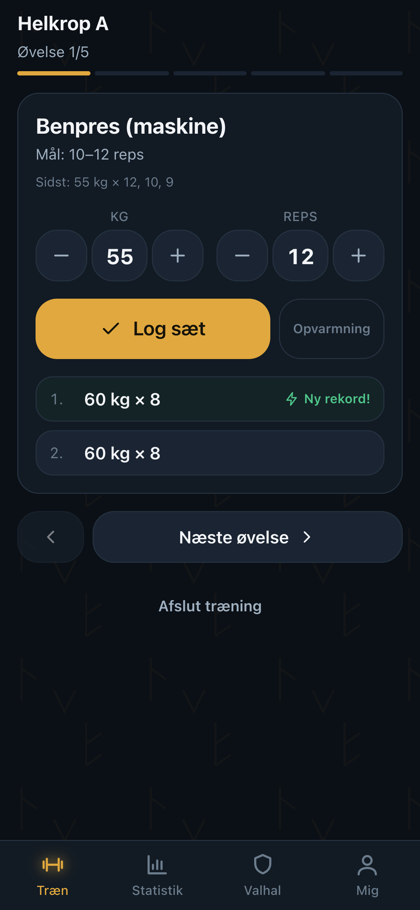
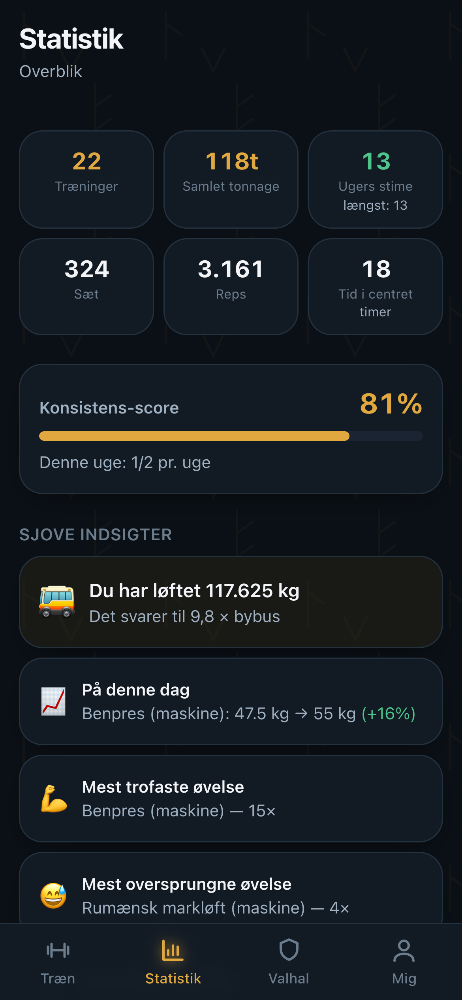
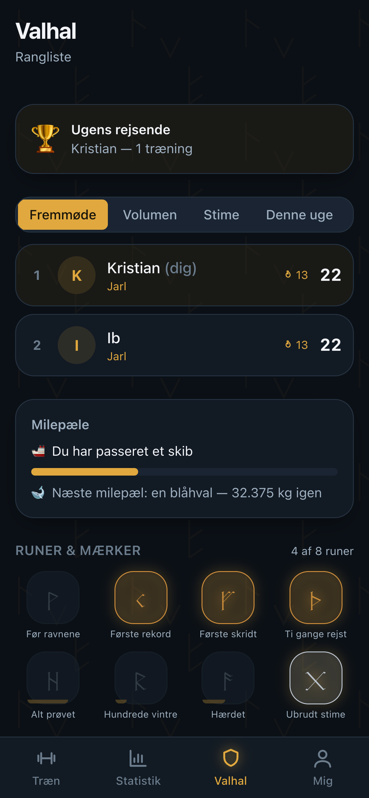
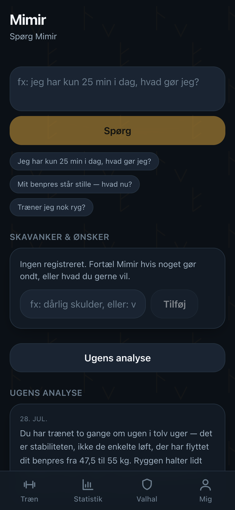
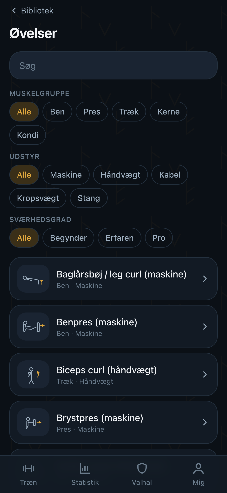

# Uruz ᚢ

> **Styrkerunen.** En træningsapp til iPhone og web, hvor du logger styrketræning
> lynhurtigt, får coaching af **Mimir**, ser ærlig statistik og bliver holdt til
> ilden af ravnene **Huginn & Muninn**.

Uruz er bygget mobil-først til brug i et fitnesscenter: store knapper, få tryk
pr. sæt, og den virker **selv uden internet** — sæt gemmes lokalt og
synkroniserer af sig selv, når nettet er tilbage.

Den kører som en **[Rune i Yggdrasil Panel](https://yggdrasilpanel.com)** — ét
klik fra panelet, og den står og kører med sin egen database og backup.
Den kan også køre helt for sig selv med `docker run` eller lokalt med `npm run dev`.

**[uruz-training.com](https://uruz-training.com)** · [Yggdrasil Panel](https://yggdrasilpanel.com)

> ⚠️ **Tidlig udvikling, bygget med Claude Code.** Stilles til rådighed som den
> er — uden nogen form for garanti og uden noget ansvar overhovedet. Du bruger
> den udelukkende på eget ansvar.
>
> ⚠️ **Early development & built with Claude Code.** Provided as-is, with no
> warranty and no liability whatsoever — you use it entirely at your own risk.

---

## Sådan ser den ud

| | | |
|:--:|:--:|:--:|
|  |  |  |
| **Træn** — dagens træning, eller vælg frit | **Log et sæt** — forudfyldt, ét tryk | **Statistik** — tonnage, fremgang, indsigter |
|  |  |  |
| **Valhal** — rangliste, runer og milepæle | **Mimir** — ugens analyse og "spørg om alt" | **Bibliotek** — øvelser med trin og cues |

<sub>Skærmbillederne er taget af `npm run gen:screenshots` med demo-data — ingen
rigtige personers træning.</sub>

---

## Kom i gang på 2 minutter

Du skal have [Node.js](https://nodejs.org) version 22 eller nyere. Åbn en
terminal i mappen med projektet og skriv:

```bash
npm install
```

```bash
npm run setup
```

```bash
npm run dev
```

Åbn så **http://localhost:3000** i browseren. Første gang bliver du bedt om at
oprette administrator-kontoen — det er dig.

> **Det var det.** Der er ingen database at installere, ingen konti at oprette
> og ingen nøgler at skaffe for at komme i gang. Alt det kommer senere, og kun
> hvis du vil have AI-coach, notifikationer eller drift i skyen.

### Vil du bare kigge på en app med data i?

```bash
npm run db:seed:demo && npm run db:seed:history
```

Det opretter demo-brugerne Kristian og Ib og ~12 ugers realistisk træning, så
statistik, Valhal og badges har noget at vise.

---

## Hvad kan den?

| Område | Hvad du får |
|---|---|
| **Log træning** | Vælg en færdig træning eller træn frit. Sæt er forudfyldt med sidste gangs vægt × reps — som regel skal du bare bekræfte. Hviletimer starter selv. Rekorder fejres med det samme. |
| **Virker offline** | Alt logges lokalt først. Er der intet net i kælderen, kommer det med op — appen synkroniserer selv bagefter. Intet går tabt. |
| **Bibliotek & builder** | 14 øvelser med tegning, trin og cues + 7 færdige træninger. Byg din egen, eller dublér en skabelon og justér den. |
| **Statistik** | Fremgang pr. øvelse, tonnage, fremmøde-kalender, muskelbalance, rekorder — og sjove indsigter ("Du har løftet 9,8 × bybus 🚌"). |
| **Mimir (AI-coach)** | Ugentlig analyse, "Spørg Mimir" og — vigtigst — *fortæl om en skavank eller et ønske*, så tilpasser han træningen. Virker med enhver AI-udbyder, også en model på dit eget net. |
| **Valhal** | Venlig kappestrid, runer/badges, rangorden fra Thræl til Einherjer og milepæle. |
| **Ravnene** | Reminders på dine træningsdage, ros efter en god tur og et blidt puf hvis du har været væk. Tonen kan sættes blød eller hård. |
| **Admin** | Invitér folk, styr roller, redigér det fælles bibliotek, se audit-log og status på AI/push/e-mail. |
| **Sprog** | Dansk og engelsk — også øvelsesindholdet, ikke bare knapperne. |

---

## Installér på din iPhone

Uruz er en PWA: den lægger sig på hjemmeskærmen og opfører sig som en rigtig app.

1. Åbn appen i **Safari** (kun Safari kan installere på iOS).
2. Tryk på **Del-ikonet** (firkanten med pil op) nederst.
3. Rul ned og tryk **"Føj til hjemmeskærm"**.
4. Tryk **"Tilføj"**.

På Mac/PC: åbn i Chrome eller Edge og klik installér-ikonet i adresselinjen.

Guiden findes også inde i appen under **Mig → Installér app**.

---

## Tilvalg: AI-coach, notifikationer og e-mail

Alt herunder er valgfrit. Uruz virker uden — Mimir giver stadig konkrete,
data-baserede forslag, de er bare regelbaserede i stedet for formuleret af en
sprogmodel.

Kopiér `.env.example` til `.env.local` og udfyld det, du vil bruge:

```bash
cp .env.example .env.local
```

### Mimir (AI)

Uruz er **ikke bundet til én leverandør**. Sæt `AI_PROVIDER` til `anthropic`,
`openai`, `google`, `ollama` eller `custom`.

```bash
# Egen model på eget netværk (ingen API-nøgle nødvendig)
AI_PROVIDER=custom
AI_BASE_URL=http://din-server.lan:8080/v1
AI_MODEL=gemma-4-26b-qat
```

```bash
# Eller en skytjeneste
AI_PROVIDER=anthropic
AI_MODEL=claude-sonnet-5
AI_API_KEY=sk-ant-…
```

Tjek forbindelsen under **Mig → Admin → AI-status**.

### Notifikationer (web push)

```bash
npm run gen:vapid
```

Læg de to nøgler den udskriver i `.env.local`. Uden dem sendes reminders på
e-mail i stedet.

### E-mail

Uruz sender login-links, invitationer og reminders. Vælg én af to veje:

**Din egen mailserver (SMTP)** — det du sandsynligvis allerede har hos dit
webhotel, i firmaet, eller en Gmail-konto med et app-kodeord:

```bash
SMTP_HOST=smtp.dit-domæne.dk
SMTP_PORT=587
SMTP_USER=uruz@dit-domæne.dk
SMTP_PASSWORD=…
EMAIL_FROM="Uruz <uruz@dit-domæne.dk>"
```

Port 587 taler klartekst og opgraderer med STARTTLS; 465 er TLS fra første
byte. Det udleder Uruz selv af porten — `SMTP_SECURE=true|false` overstyrer,
hvis din server er speciel.

**Eller en API-nøgle** fra [resend.com](https://resend.com): sæt
`RESEND_API_KEY` og `EMAIL_FROM`. Er begge dele sat, vinder SMTP.

Sætter du ingen af delene, skrives e-mails ud i terminalen i stedet —
invitations- og login-links virker altså stadig, mens du udvikler.

> Mange udbydere afviser en afsender de ikke mener er din. Peger `EMAIL_FROM`
> på et domæne du ikke sender fra, ryger mailen i filteret eller retur.
> **Mig → Admin** viser hvilken af de tre veje der faktisk er i brug.

### Reminders skal have et ur

Reminders sendes af `/api/cron`, som skal kaldes med jævne mellemrum (hvert
kvarter er fint). Sæt `CRON_SECRET` i `.env.local` og peg fx Vercel Cron,
Supabase scheduled functions eller en simpel cron-linje på:

```bash
curl -H "Authorization: Bearer $CRON_SECRET" https://din-app.dk/api/cron
```

---

## Drift som Rune i Yggdrasil Panel

Uruz er først og fremmest bygget til at køre som en **Rune** i
**[Yggdrasil Panel](https://yggdrasilpanel.com)** — panelet, der gør en server
til noget man kan pege og klikke på. En Rune er en app panelet kan så: du
vælger den, udfylder et par felter, og så står den og kører med sin egen
datamappe og sin egen backup.

1. **Runes → Carve a rune** → importér [`yggdrasil/uruz.yaml`](yggdrasil/uruz.yaml)
2. Så en server ud fra runen og giv den et subdomæne
3. Udfyld felterne du vil bruge (AI, e-mail, notifikationer — alt er valgfrit)

Alle variabler er beskrevet i manifestet, og appen udleder selv sin adresse,
så den virker bag panelets proxy uden håndkonfiguration.

Vil du hellere køre den for dig selv, er det ét kald:

```bash
docker run -d -p 3000:3000 -v uruz-data:/data ghcr.io/kristianwind/uruz:latest
```

Imaget bygges multi-arch (amd64 + arm64) af GitHub Actions ved hvert push.
Panelets egen kildekode ligger i
[kristianwind/yggdrasil](https://github.com/kristianwind/yggdrasil).

---

## Drift i skyen (Supabase + Vercel)

Lokalt kører Uruz på en indbygget SQLite-fil — nul opsætning. Til produktion:

1. Opret et projekt på [supabase.com](https://supabase.com).
2. Kør de to migrationer i `supabase/migrations/` (SQL-editoren duer fint).
   De opretter skemaet **og** Row Level Security, så ingen kan se andres rå
   træningslogs — heller ikke hvis der skulle være en fejl i app-koden.
3. Sæt `DATA_BACKEND=supabase` og Supabase-nøglerne i miljøvariablerne.
4. Deploy til [Vercel](https://vercel.com) og sæt de samme variabler der.

---

## Kommandoer

| Kommando | Hvad den gør |
|---|---|
| `npm run dev` | Starter appen lokalt |
| `npm run setup` | Klargør database + indhold (kør én gang) |
| `npm run db:seed` | Indlæser øvelser, skabeloner og badges |
| `npm run db:seed:demo` | Som ovenfor + demobrugere |
| `npm run db:seed:history` | ~12 ugers demo-træningsdata |
| `npm run db:reset` | Sletter den lokale database |
| `npm test` | Kører testene |
| `npm run typecheck` | Tjekker typer |
| `npm run build:check` | Prøve-build (rører ikke dev-serveren) |
| `npm run gen:icons` | Gentegner app-ikonerne |
| `npm run gen:vapid` | Laver nøgler til notifikationer |
| `npm run gen:screenshots` | Tager skærmbillederne ovenfor med demo-data |

---

## Dokumentation

- **[HANDOFF.md](HANDOFF.md)** — status, hvad der er verificeret, og hvad der ikke er.
- **[ARCHITECTURE.md](ARCHITECTURE.md)** — hvordan det hænger sammen, og hvorfor.
- **[DECISIONS.md](DECISIONS.md)** — hver ikke-oplagt beslutning og dens begrundelse.
- **[website/](website/)** — præsentationssitet bag
  [uruz-training.com](https://uruz-training.com), på dansk og engelsk. Åbn
  `website/index.html` i en browser.

---

## En ærlig note om Mimir

Mimir er en træningscoach, ikke en læge. Han giver ikke kostråd, kommenterer
aldrig på krop eller vægt, og henviser til læge eller fysioterapeut ved smerte.
Det er bygget ind i hans instruktioner og kan ikke slås fra — heller ikke med
den "hårde" tone, som kun gør ham mere kontant, aldrig nedladende.

---

*Uruz ᚢ — byg styrke, én rune ad gangen.*
