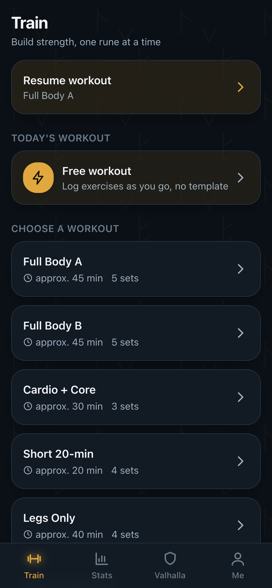
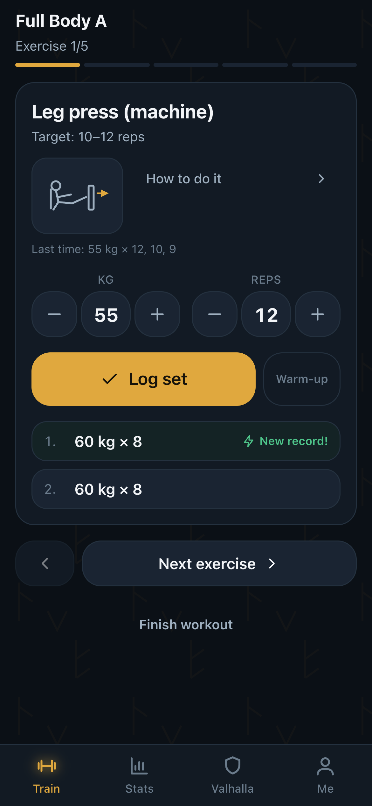
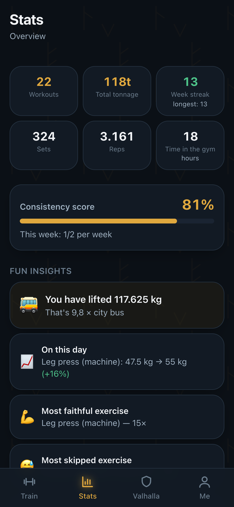
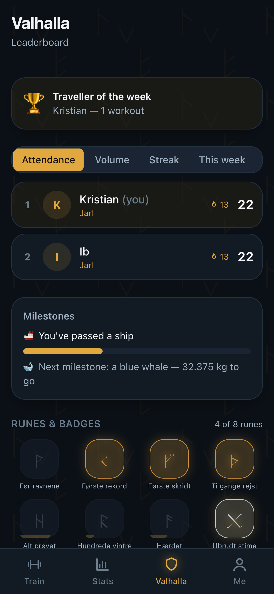
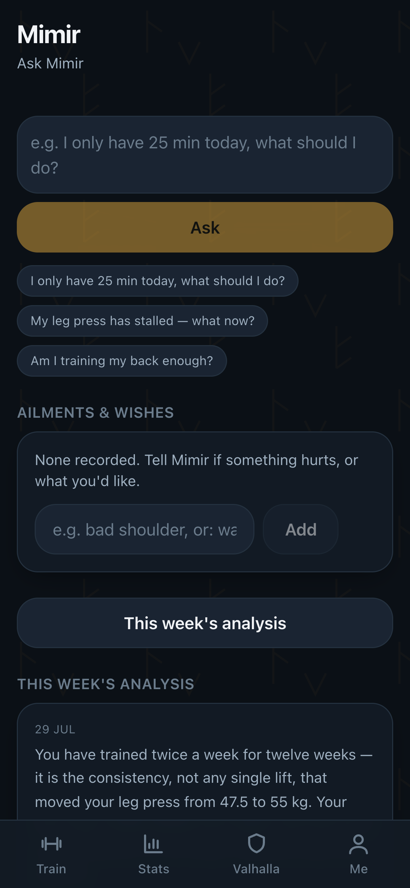
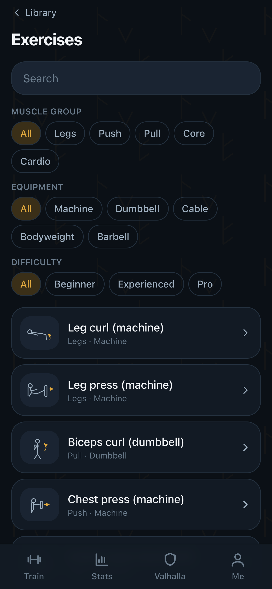

# Uruz ᚢ

> **The strength rune.** A training app for iPhone and web: log your sets fast,
> get coached by **Kvasir**, see honest statistics, and be kept at it by the
> ravens **Huginn & Muninn**.

Uruz is built mobile-first for use in a gym: big buttons, few taps per set, and
it works **with no internet at all** — sets are saved on the device and sync
themselves when the signal comes back.

It runs as a **[Rune in Yggdrasil Panel](https://yggdrasilpanel.com)** — one
click from the panel and it is up with its own database and backups. It also
runs perfectly well on its own with `docker run`, or locally with `npm run dev`.

**[uruz-training.com](https://uruz-training.com)** · [Yggdrasil Panel](https://yggdrasilpanel.com) · [På dansk](README.da.md)

> ⚠️ **Early development & built with Claude Code.** Provided as-is, with no
> warranty and no liability whatsoever — you use it entirely at your own risk.
> Free software under **[AGPL-3.0](LICENSE)**.

---

## What it looks like

| | | |
|:--:|:--:|:--:|
|  |  |  |
| **Train** — today's workout, or pick freely | **Log a set** — prefilled, one tap | **Stats** — tonnage, progress, insights |
|  |  |  |
| **Valhalla** — leaderboard, runes and milestones | **Kvasir** — the weekly analysis and "ask anything" | **Library** — exercises with steps and cues |

<sub>Taken by `npm run gen:screenshots` against demo data — nobody's real
training. `npm run gen:screenshots:da` renders the app in Danish.</sub>

---

## Pick one of three ways

The three ways to run Uruz are **alternatives, not steps**. Pick one:

| | For whom | Where |
|---|---|---|
| **Locally with Node** | Trying it out, or working on it | [Up and running in 2 minutes](#up-and-running-in-2-minutes) below |
| **Docker** | Running it permanently on a machine you have | [Running it with Docker](#running-it-with-docker) |
| **A Rune in Yggdrasil Panel** | You already run the panel and want its backups and updates | [Running it as a Rune](#running-it-as-a-rune-in-yggdrasil-panel) |

All three run exactly the same app against the same data. You can start locally
and move it later — the database is one file you can carry.

---

## Up and running in 2 minutes

*The local route. If it should run permanently, take Docker or Yggdrasil.*

You need [Node.js](https://nodejs.org) 22 or newer. Open a terminal in the
project folder:

```bash
npm install
```

```bash
npm run setup
```

```bash
npm run dev
```

Then open **http://localhost:3000**. The first screen asks you to create the
administrator account — that is you.

> **That is all.** No database to install, no accounts to create, no keys to
> obtain. All of that comes later, and only if you want the AI coach,
> notifications or cloud hosting.

### Just want to see it with data in it?

```bash
npm run db:seed:demo && npm run db:seed:history
```

That creates demo users and about twelve weeks of plausible training, so the
statistics, Valhalla and the badges have something to show.

---

## What it does

| Area | What you get |
|---|---|
| **Logging** | Pick a ready-made workout or train freely. Sets are prefilled with last time's weight × reps — usually you just confirm. The rest timer starts itself. Records are celebrated on the spot. |
| **Works offline** | Everything is logged locally first. No signal in the basement is not a problem: it syncs itself afterwards, and nothing is lost. |
| **Library & builder** | 14 exercises with a drawing, steps and cues, plus 7 ready-made workouts. Build your own, or duplicate a template and adjust it. |
| **Statistics** | Progress per exercise, tonnage, an attendance calendar, muscle balance, records — and fun insights ("you have lifted 9.8 × a city bus 🚌"). |
| **Kvasir (AI coach)** | A weekly analysis, "ask Kvasir", a programme laid out from four questions — and, most usefully, *tell him about a niggle or a wish* and he adapts the training around it. Works with any AI provider, including a model on your own network. Without one, the plans and suggestions are built from rules instead. |
| **Valhalla** | Friendly rivalry, runes and badges, ranks from Thrall to Einherjar, and milestones. |
| **The ravens** | Reminders on your training days, praise after a good session, and a gentle push if you have been away. The tone can be set gentle or tough. |
| **Admin** | Invite people, manage roles, edit the shared library, read the audit log, and see the status of AI, push and email. |
| **Languages** | English and Danish — including the exercise content, not just the buttons. |

---

## Install it on your iPhone

Uruz is a PWA: it sits on the home screen and behaves like a real app.

1. Open it in **Safari** — only Safari can install on iOS.
2. Tap the **share icon** (the square with an arrow) at the bottom.
3. Scroll down and tap **"Add to Home Screen"**.
4. Tap **"Add"**.

On a computer: open it in Chrome or Edge and click the install icon in the
address bar.

There is a walkthrough inside the app under **Me → Install app**.

---

## Optional: AI coach, notifications and email

Everything below is optional. Uruz works without it — Kvasir still gives
concrete, data-driven suggestions; they are rule-based rather than written by a
language model.

Copy `.env.example` to `.env.local` and fill in what you want:

```bash
cp .env.example .env.local
```

### Kvasir (AI)

Uruz is **not tied to one vendor**. Set `AI_PROVIDER` to `anthropic`, `openai`,
`google`, `ollama` or `custom`.

```bash
# Your own model on your own network — no API key needed
AI_PROVIDER=custom
AI_BASE_URL=http://your-server.lan:8080/v1
AI_MODEL=gemma-4-26b-qat
```

```bash
# Or a hosted one
AI_PROVIDER=anthropic
AI_MODEL=claude-sonnet-5
AI_API_KEY=sk-ant-…
```

Check the connection under **Me → Admin → AI status**.

### Notifications (web push)

```bash
npm run gen:vapid
```

Put the two keys it prints into `.env.local`. Without them, reminders go by
email instead.

### Email

Uruz sends sign-in links, invitations and reminders. Two ways, one fallback.

**Your own mail server (SMTP)** — likely what you already have at your host, at
work, or a Gmail account with an app password:

```bash
SMTP_HOST=smtp.example.com
SMTP_PORT=587
SMTP_USER=uruz@example.com
SMTP_PASSWORD=…
EMAIL_FROM="Uruz <uruz@example.com>"
```

Port 587 starts in plaintext and upgrades with STARTTLS; 465 is TLS from the
first byte. Uruz derives that from the port — `SMTP_SECURE=true|false`
overrides it if your server is unusual.

**Or an API key** from [resend.com](https://resend.com): set `RESEND_API_KEY`
and `EMAIL_FROM`. If both are configured, SMTP wins.

Set neither, and messages are written to the terminal instead — invitation and
sign-in links still work while you are developing.

> Many providers reject a sender they do not consider yours. If `EMAIL_FROM`
> points at a domain you do not send from, mail lands in spam or bounces.
> **Me → Admin** shows which of the three routes is actually in use.

### Reminders keep their own clock

In production the app ticks its own scheduler every fifteen minutes — reminders
work with no setup at all. If you would rather drive it from an external
scheduler (Vercel Cron, a Supabase scheduled function, or a plain cron line),
set `CRON_SECRET` and call:

```bash
curl -H "Authorization: Bearer $CRON_SECRET" https://your-app.example.com/api/cron
```

The work is idempotent, so both at once is harmless; set `URUZ_SCHEDULER=0` if
the external one should be the only driver.

---

## Running it with Docker

*One machine, one container, no panel.*

```bash
docker run -d --name uruz -p 3000:3000 -v uruz-data:/data \
  ghcr.io/kristianwind/uruz:latest
```

The image is built for both `amd64` and `arm64`, so it runs on a Raspberry Pi
too. `/data` is everything — the SQLite file and its write-ahead log. Mount it
somewhere you back up.

The full recipe is in **[Hosting Uruz yourself](docs/guides/self-hosting.md)**.

---

## Running it as a Rune in Yggdrasil Panel

Uruz is built first and foremost to run as a **Rune** in
**[Yggdrasil Panel](https://yggdrasilpanel.com)** — the panel that turns a
server into something you can point and click at. A Rune is an app the panel can
plant: you pick it, fill in a few fields, and it is up with its own data
directory and its own backups.

1. **Runes → Carve a rune** → import [`yggdrasil/uruz.yaml`](yggdrasil/uruz.yaml)
2. Create a server from the rune and give it a subdomain
3. Fill in the fields you want — AI, email, notifications are all optional

Every variable is described in the manifest, and the app works out its own
address, so it runs behind the panel's proxy with no hand-configuration.

The image is built multi-arch by GitHub Actions on every push. The panel's own
source is at [kristianwind/yggdrasil](https://github.com/kristianwind/yggdrasil).

---

## Running it in the cloud (Supabase + Vercel)

Locally Uruz runs on a built-in SQLite file — zero setup. For production:

1. Create a project at [supabase.com](https://supabase.com).
2. Run the migrations in `supabase/migrations/` (the SQL editor is fine). They
   create the schema **and** Row Level Security, so nobody can read anyone
   else's raw training logs — not even if the app code has a bug.
3. Set `DATA_BACKEND=supabase` and the Supabase keys as environment variables.
4. Deploy to [Vercel](https://vercel.com) and set the same variables there.

> Worth knowing: the Supabase schema exists and the policies are written, but
> the adapter is not built yet — the app runs on SQLite today. See
> [HANDOFF.md](HANDOFF.md).

---

## Commands

| Command | What it does |
|---|---|
| `npm run dev` | Starts the app locally |
| `npm run setup` | Prepares the database and content (run once) |
| `npm run db:seed` | Loads exercises, templates and badges |
| `npm run db:seed:demo` | As above, plus demo users |
| `npm run db:seed:history` | ~12 weeks of demo training data |
| `npm run db:reset` | Deletes the local database |
| `npm test` | Runs the tests |
| `npm run typecheck` | Checks types |
| `npm run build:check` | A trial build that leaves the dev server alone |
| `npm run gen:icons` | Redraws the app icons |
| `npm run gen:vapid` | Generates notification keys |
| `npm run gen:screenshots` | Takes the screenshots above, against demo data |
| `npm run gen:docs` | Renders the guides into the website |

---

## Documentation

**Guides:**

- **[Using Uruz](docs/guides/using-uruz.md)** — for the person training. Signing
  in, putting it on your phone, logging a workout, correcting a set, the
  archive, building your own workouts, Kvasir, Valhalla, reminders, and getting
  your data out.
- **[Hosting Uruz yourself](docs/guides/self-hosting.md)** — for whoever runs
  the server. Three ways to run it, email, AI, notifications, backup, updating,
  and the traps that are easy to fall into.

**Background:**

- **[HANDOFF.md](HANDOFF.md)** — current state, what has been verified against
  reality, and what has not. *(Danish)*
- **[ARCHITECTURE.md](ARCHITECTURE.md)** — how the pieces fit together, and why.
  *(Danish)*
- **[DECISIONS.md](DECISIONS.md)** — every non-obvious decision and its
  reasoning. *(Danish)*
- **[docs/COMMERCIAL.md](docs/COMMERCIAL.md)** — a draft plan for running Uruz
  as a hosted service alongside the free one. *(Danish)*
- **[website/](website/)** — the site behind
  [uruz-training.com](https://uruz-training.com): English on the front,
  Danish at `/da.html`.

---

## An honest note about Kvasir

Kvasir is a training coach, not a doctor. He gives no dietary advice, never
comments on your body or your weight, and refers you to a doctor or a
physiotherapist when something hurts. That is built into his instructions and
cannot be switched off — not even with the "tough" tone, which only makes him
blunter, never unkind.

---

## Licence

Uruz is free software under the
**[GNU Affero General Public License v3.0](LICENSE)**.

Run it, read it, share it, change it. The *Affero* part is the one that matters
for an app like this: if you change it and other people use your version over a
network, they are entitled to your source. Running it — modified or not — for
yourself, your friends or your training partner carries no obligation beyond
leaving the notices intact. Selling hosting built on a closed fork does.

Chosen over MIT because it costs nothing in practice and keeps the door open to
saying no to a closed copy later. Open core was rejected — keeping features out
of the free version is exactly the mechanism that turns it into a leftover, and
the two tracks are meant to be the same app.

Copyright © 2026 Kristian Wind.

---

*Uruz ᚢ — build strength, one rune at a time.*
